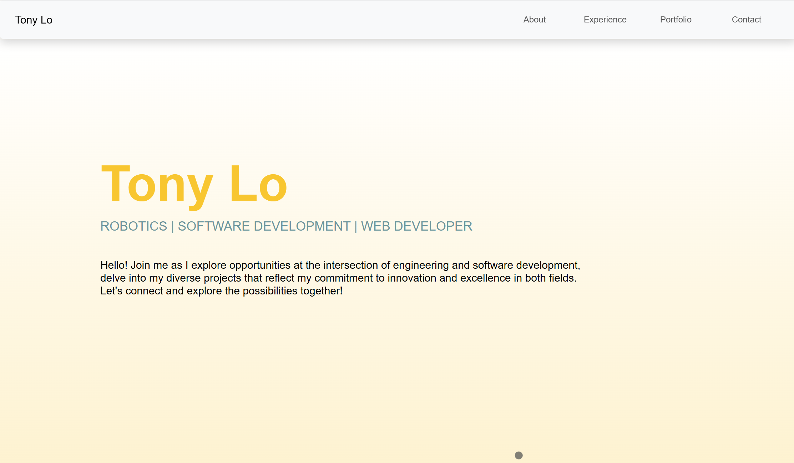
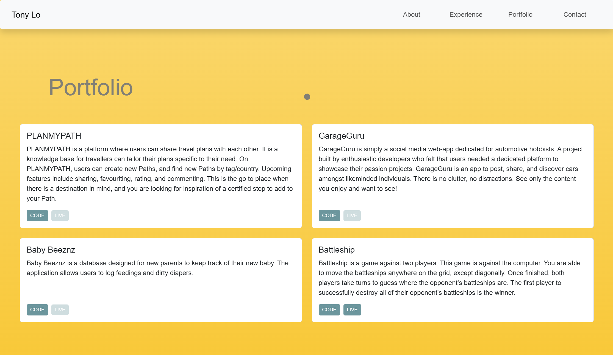
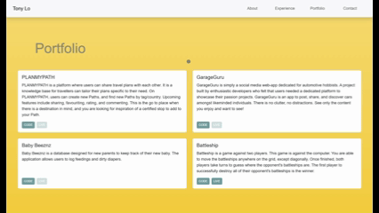

# Tony Lo's Portfolio

This portfolio was made using React and hosted on Firebase.  

## Purpose

Initially the page was designed as a quick landing page for the audience to get to know me.  The purpose of this website is to allow the viewer to contact me for future work.

## Design

The design is simple and it is my first time designing a landing page.  There are some elements implemented from what I like from visiting other websites, such as a static navbar and a dynamic cursor.

I enjoyed figuring out how to set a gradient background, as well as working with different CSS frameworks to help with a unified look.

My favourite element was figuring out how to implement the peek-a-boo footer.  Behind the curtain, it unveiled my contact information, and the page footer showing my socials.

